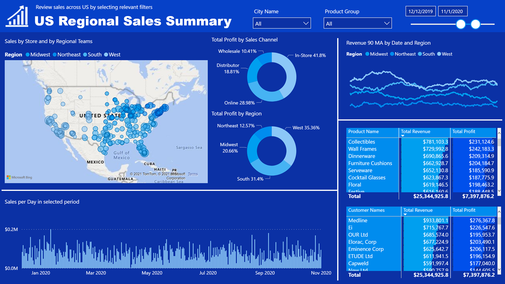

# US Regional Sales Analysis Dashboard

The following interactive Power BI dashboard helps in analyzing the sales across the regions of the United States 


```python
%%html
<iframe 
title="US Regional Sales Report" width="1000" height="600" 
src="https://app.powerbi.com/view?r=eyJrIjoiYzJiNWRkOWUtYzFmNi00NzVmLTg0NWMtZTljZWY4MmQwZmZlIiwidCI6IjcwODlkNGIxLTQyMmUtNDYzZi1hNGM3LTViY2FiOTk0MGRiZCJ9&pageName=ReportSection8b0879d590be87cd63d7" 
frameborder="0" allowFullScreen="true">
</iframe>
```


<iframe 
title="US Regional Sales Report" width="1000" height="600" 
src="https://app.powerbi.com/view?r=eyJrIjoiYzJiNWRkOWUtYzFmNi00NzVmLTg0NWMtZTljZWY4MmQwZmZlIiwidCI6IjcwODlkNGIxLTQyMmUtNDYzZi1hNGM3LTViY2FiOTk0MGRiZCJ9&pageName=ReportSection8b0879d590be87cd63d7" 
frameborder="0" allowFullScreen="true">
</iframe>


All the visuals in the dashboards are cross-filters one-another which helps in deep-dive analysis of the data.

This one pager dashboard shows the following:

- **Map Visual**: Sales by store locations & regions
- **Column Trend Visual**: Sales over period
- **Donut visual**: Profit by channel
- **Donut visual**: Profit by region
- **Column Trend Visual**: 90 days moving average revenue by region
- **Matrix visual**: Revenue & Profit by products
- **Matrix visual**: Revenue & Profit by customers

The dashboard can also be viewed in the browser from here: [US Regional Sales Analysis][dashboard_link]

<a href = 'https://app.powerbi.com/view?r=eyJrIjoiYzJiNWRkOWUtYzFmNi00NzVmLTg0NWMtZTljZWY4MmQwZmZlIiwidCI6IjcwODlkNGIxLTQyMmUtNDYzZi1hNGM3LTViY2FiOTk0MGRiZCJ9&pageName=ReportSection8b0879d590be87cd63d7' target="_blank">
    
</a>


[dashboard_link]: https://app.powerbi.com/view?r=eyJrIjoiYzJiNWRkOWUtYzFmNi00NzVmLTg0NWMtZTljZWY4MmQwZmZlIiwidCI6IjcwODlkNGIxLTQyMmUtNDYzZi1hNGM3LTViY2FiOTk0MGRiZCJ9&pageName=ReportSection8b0879d590be87cd63d7
